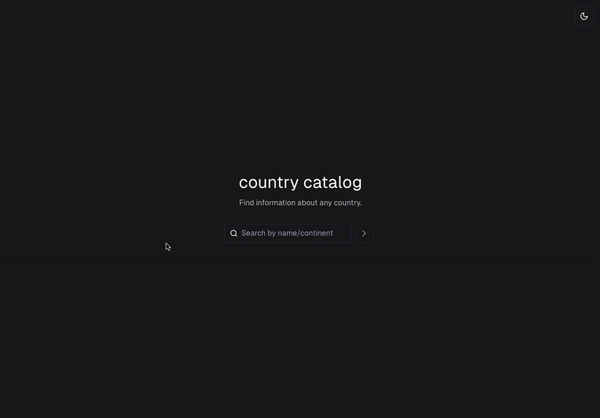

# 🌍 Country Catalog

Country Catalog is a web application that allows users to search for countries and access detailed information about them, including a generated travel guide using the GPT-4 API. It combines a sleek frontend interface with a robust backend to deliver relevant data efficiently.

**Link:**
[https://countrycatalog.vercel.app/](https://countrycatalog.vercel.app/)
## 🎥 Demos 

<div style="display: flex; justify-content: space-around;">
  
  
</div>

## 🌟 Features 

- **Country Information:** Search for countries and view detailed information including a dynamically generated travel guide.
- **Interactive UI:** Drawer animation for displaying country details, powered by [Emil Kowalski's Drawer Component](https://vaul.emilkowal.ski/).
- **Responsive Design:** Optimized for both desktop and mobile devices.
- **External Links:** Quick access to Google Maps, Twitter, and Google Flights for each country.
- **Travel Guide Generation:** Create personalized travel guides for each country using the GPT-4 API.

## 🚀 Getting Started

These instructions will get you a copy of the project up and running on your local machine for development and testing purposes.

### Prerequisites

What things you need to install the software:

- Node.js
- npm (Node Package Manager)

### Installing

A step-by-step series of examples that tell you how to get a development environment running.

**1. Clone the repository:**
   ```
   git clone https://github.com/ruzzelwidjaja/country-catalog.git
   ```
**2. Install dependencies for both client and server:**
   ```
   npm run install-all
   ```
### Running the Application
To run the application, you'll need to start both the client and the server separately. In the root directory, follow these steps:

**1. Start the Client:**
   ```
   npm run client
   ```
- The client will now be running at your localhost react port.
  
**2. Start the Server:**
- Open a new terminal.
- Navigate to the root directory of the project as before.
- Start the server application:
   ```
   npm run server
   ```
- The server will now be running and will listen to requests, typically on port 3001.

Make sure to keep both the client and server running to use the application. You can access the web interface through your browser at the client's URL.

## 🛠️ Tech Stack 

- **Frontend:** React, TypeScript, Tailwind CSS, Framer Motion
- **Backend:** Node.js, Express
- **UI Components:** shadcn/ui, Vaul by Emil Kowalski
- **Icons:** Lucide
- **APIs:** RestCountries, OpenAI (GPT-4)
- **Testing:**
   - **Frontend:** Vitest
   - **Backend:** Jest
